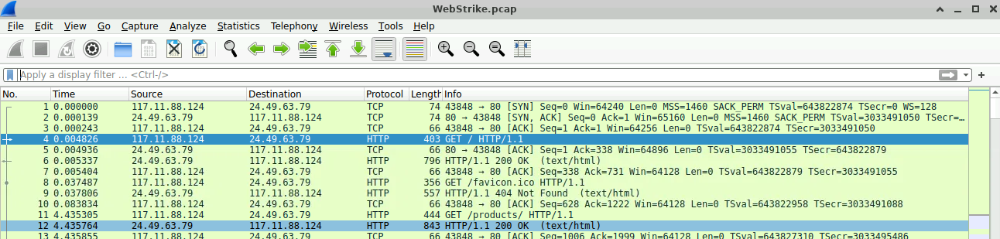

# Skills
#NetworkForensics
#WireShark
# Scenario: 
A suspicious file was identified on a company web server, raising alarms within the intranet. The Development team flagged the anomaly, suspecting potential malicious activity. To address the issue, the network team captured critical network traffic and prepared a PCAP file for review.
## Your task:
To analyze the provided PCAP file to uncover how the file appeared and determine the extent of any unauthorized activity.
## Tools used: 
Wireshark & Web-browser for IP Lookup
# Write-Up:
Opening the .pcap file opens up WireShark to start the Network Forensics.
### Question 1: Identifying the geographical origin of the attack facilitates the implementation of geo-blocking measures and the analysis of threat intelligence. From which city did the attack originate?

![[Q2.5.png]]
I found the IP addressing making a GET HTTP request. There are only two IPs, so brute-forcing this would be possible. 
The IP was from Tianjin, China - IP: 117.11.88.124
The other IP was from Hagerstown, Maryland. 

### Question 2: Knowing the attacker's User-Agent assists in creating robust filtering rules. What's the attacker's Full User-Agent?
![[Q2.png]]
I clicked on the first GET request I saw after filtering with "http.request.method == GET" and expanded the HTTP section for the User-Agent.
The User-Agent: "Mozilla/5.0 (X11; Linux x86_64; rv:109.0) Gecko/20100101 Firefox/115.0"
This took me 22 tries to get correct as I included the full path and the answer needed just above. I was questioning myself and my sanity. 

### Question 3: We need to determine if any vulnerabilities were exploited. What is the name of the malicious web shell that was successfully uploaded?
![[Q3.png]]
I found and clicked on HTTP POST as that's commonly used for file uploads. 
In order to see if this one was successful, right-click and follow the HTTP Stream.

![[Q3.5.png]]
Once it's seen that it's successful, read the stream and find the file after "filename=".
The name of the file: "image.jpg.php"

### Question 4: Identifying the directory where uploaded files are stored is crucial for locating the vulnerable page and removing any malicious files. Which directory is used by the website to store the uploaded files?
![[Q4.png]]
For this, I used the "http.request.uri" filter (possibly incorrectly).
I looked to the info (to the right) to see if I could find something that looked like a directory.
Given the format of directories and the context of the questions, I figured we were looking for something with uploads. 
The answer: "/reviews/uploads" (highlighted in blue) is what I found to be correct. 

### Question 5: Which port, opened on the attacker's machine, was targeted by the malicious web shell for establishing unauthorized outbound communication?
![[Q5.png]]
I filtered out the POST HTTP requests via "http.request.method == POST". Three results showed.

![[Q5.5.png]]
I followed the stream of one of them to find the port.

![[Q5.75.png]]
The port is 4-digits. 
It's listed after the IP address and pointed out in my custom-made black-box.
Port: 8080

### Question 6: Recognizing the significance of compromised data helps prioritize incident response actions. Which file was the attacker attempting to exfiltrate? 
![[Q6.png]]
I filtered out the POST again via "http.request.method == POST".
This one is going to be a bit different because we are looking for the attacker's IP in the DESTINATION. 
![[Q6.5.png]]
When you click the option with the attacker's IP in the destination, the bottom left frame will show the form item/key. This shows the file: "/etc/passwd". 
They were attempting to steal the passwords. 
"How dare they!", but also "oh that's neat - how and why did you do that?".

Lab Complete!

Total Time: ~1 hour and 20 minutes
Write-Up written in Vim and Obsidian.
Notes: I did click all of the hints except for the last question. I wanted to see if I found the answer correctly (or if I got lucky). I also got stuck. This was reviewed as Easy and I found it to be Medium difficulty. With no Hints, it would have taken me possibly an extra hour. 
Fun fact: This was my first-ever CyberDefenders lab. Where's my job? (jk - unless you're offering)

Back at it again tomorrow? 
